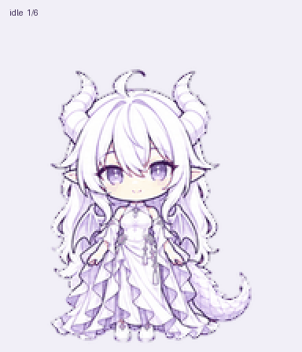

# GPT小姐 · Animated dragon-girl pet

[简体中文](README.md) | **English**

A white-haired, lilac-eyed little dragon girl with curved horns and a layered gown, here to accompany your thinking and creative work.

This character animation asset pack is intended for compatible ChatGPT Work Pets workflows. The release version is **1.0.0**, and the sprite-sheet format is **v2**.

## Package contents

- **[spritesheet-extended.png](assets/spritesheet-extended.png)**: original transparent sprite sheet, 1536 × 2288 pixels
- **[preview.gif](assets/preview.gif)**: looping preview of nine animation states, 384 × 448 pixels, 57 frames
- **[pet-metadata.json](pet-metadata.json)**: dimensions, grid layout, and frame counts for reference
- **[SHA256SUMS.txt](SHA256SUMS.txt)**: checksums for verifying file integrity
- **[ASSET_RIGHTS.md](ASSET_RIGHTS.md)**: bilingual provenance and rights notice
- **[README.md](README.md)** and **[README.en.md](README.en.md)**: complete Chinese and English instructions

The sprite sheet contains 73 populated cells: 57 frames across nine standard animations and 16 clockwise gaze directions. The GIF shows the nine standard animations; the gaze frames remain in the PNG. The GIF has a light lavender background for viewing, while the PNG retains its transparent background.

## How to use it and compatibility

1. Download the original PNG. Keep its full 1536 × 2288 dimensions and alpha channel. Do not substitute the preview GIF.
2. In a ChatGPT Work Pets workflow that explicitly supports **v2 sprite sheets**, attach the PNG and request import, validation, and pet creation from the existing sheet, preserving the artwork and every frame. Select the pet after creation finishes.
3. If the current import screen accepts only 1536 × 1872, stop that import attempt and use an entry point that supports v2. Do not resize the image or remove the gaze rows to bypass its dimension checks.

As of October 3, 2026, the [official Pets documentation](https://learn.chatgpt.com/docs/pets#upload-a-custom-pet) still specifies 1536 × 1872 for the web-upload flow. That differs from this pack's v2 format, so direct upload through that entry point is not guaranteed. Feature availability and menu names depend on the current client.

This package contains animation assets and documentation only, with no executable or independent desktop window. Import requires compatible Pets functionality. `pet-metadata.json` is descriptive metadata, not an installation script or a pet record from anyone's account.

## Sprite-sheet layout

The grid has 8 columns and 11 rows, with 192 × 208 pixels per cell. Row and column indices start at 0. Read each row from left to right; cells after its populated frames are transparent.

| Row | State | Frames | Meaning |
|---:|---|---:|---|
| 0 | idle | 6 | Resting, breathing, and blinking |
| 1 | running-right | 8 | Moving right |
| 2 | running-left | 8 | Moving left |
| 3 | waving | 4 | Waving |
| 4 | jumping | 5 | Jumping |
| 5 | failed | 8 | Blocked or failed reaction |
| 6 | waiting | 6 | Waiting for input or approval |
| 7 | running | 6 | Working on a task |
| 8 | review | 6 | Reviewing completed output |
| 9 | look-row-9 | 8 | 0°, 22.5°, 45°, 67.5°, 90°, 112.5°, 135°, 157.5° |
| 10 | look-row-10 | 8 | 180°, 202.5°, 225°, 247.5°, 270°, 292.5°, 315°, 337.5° |

Gaze angles use screen coordinates: 0° is up, 90° is right, 180° is down, and 270° is left, proceeding clockwise. `running` is the active-work state; leftward and rightward movement have their own rows.

## Provenance and rights

The publisher supplied the concept and creative direction. The character was made and revised using OpenAI image-generation tools, with internet reference material supplied by the publisher. This public package preserves the approved final animation assets; preparing this release did not redraw the character. Its frame layout comes from production records matching the final PNG.

This is an unofficial community character, not affiliated with or endorsed by OpenAI. The OpenAI-style knot hair ornament does not indicate official status. OpenAI, ChatGPT, and related marks belong to their respective rights holders.

The publisher's contributions are available under **CC0 1.0 only to the extent the publisher holds and may waive those rights**. Within that scope, use, modification, sharing, and commercial use are permitted without an attribution requirement. The provenance and licensing chain for the original internet references remain unverified. Third-party trademarks, logos, and any possible character or design rights are outside this dedication. See [Asset rights](ASSET_RIGHTS.md) for the full bilingual notice.
